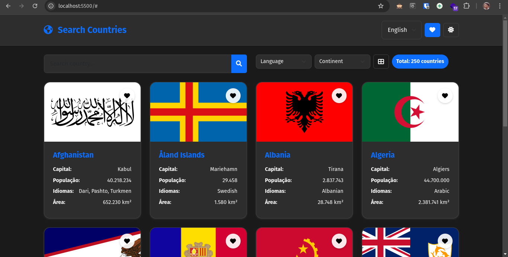
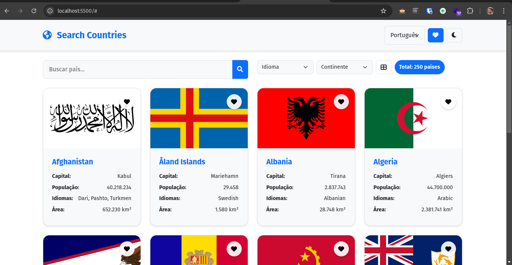
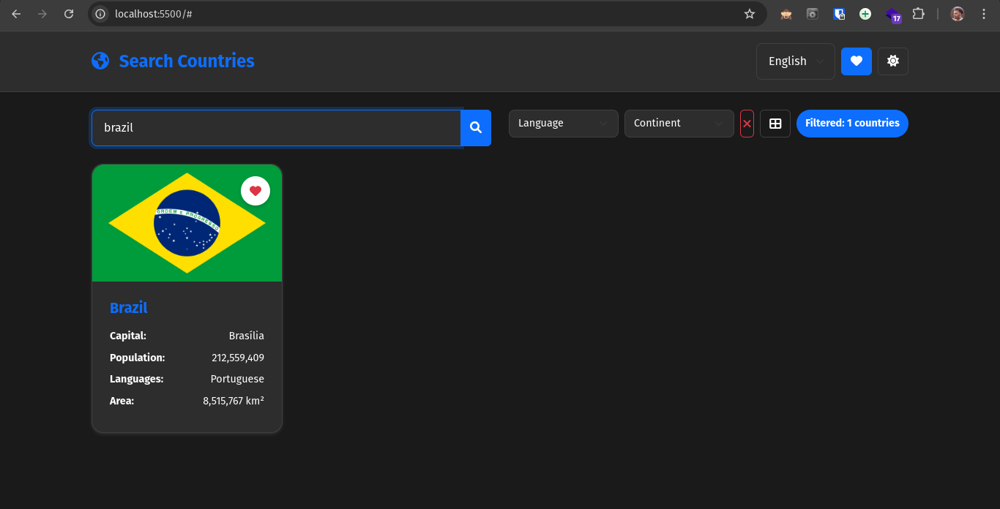
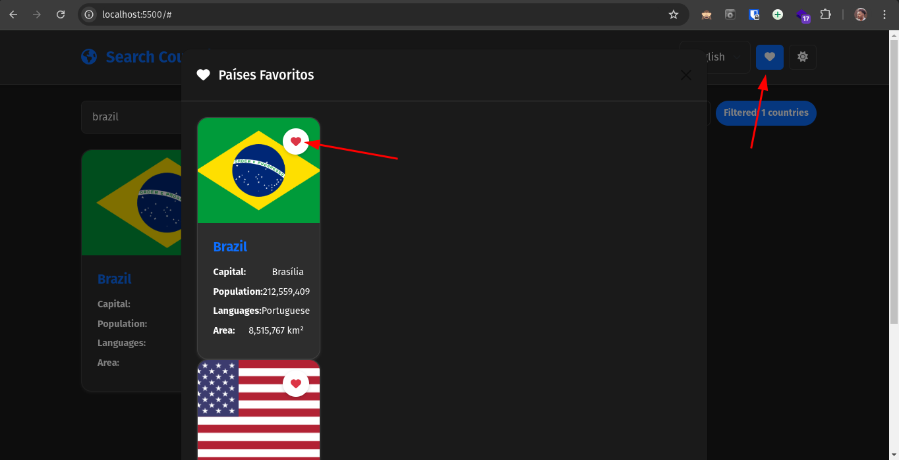
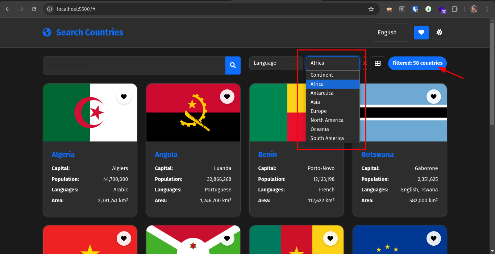
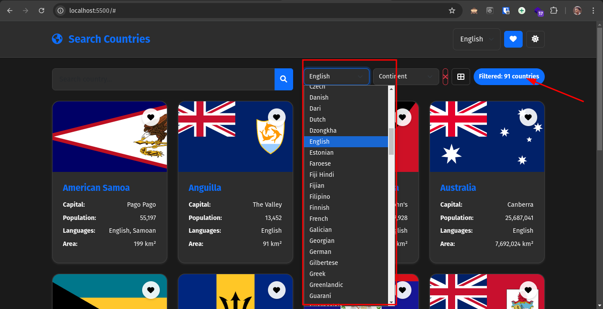
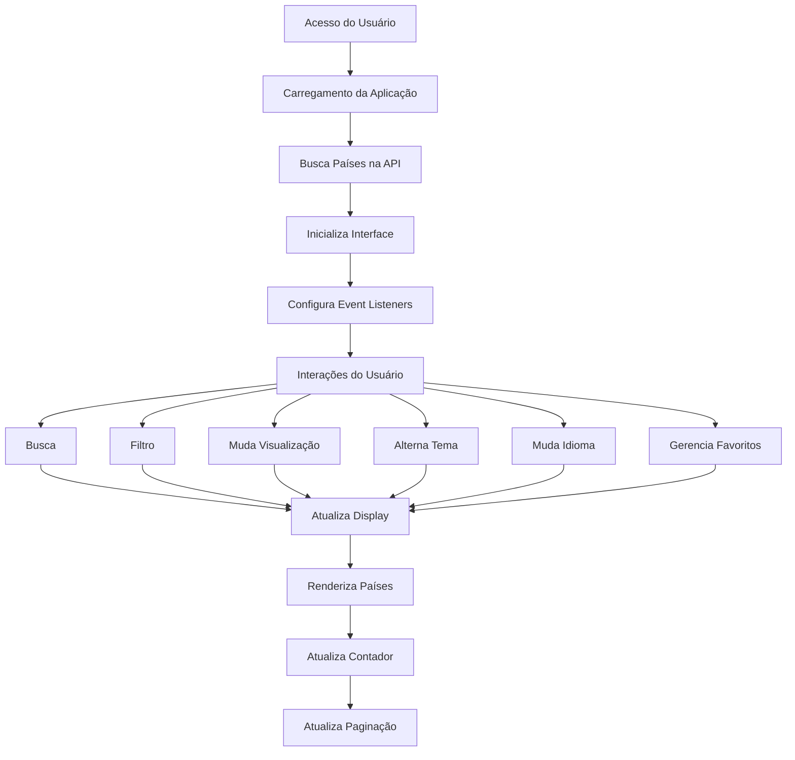

[EN](README.md)

# Search Countries 🌍

Uma aplicação web moderna, elegante e minimalista para explorar informações sobre países usando a API Rest Countries. Este projeto fornece uma interface intuitiva para os usuários pesquisarem, filtrarem e visualizarem informações detalhadas sobre países em todo o mundo.

## 🖼️ Visualizar 

<p align="center">
  <a href="assets/img/home-white.png"></a>
  <a href="assets/img/home-dark.png"></a>
  <a href="assets/img/home-pt.png"></a>
</p>

<p align="center">
  <a href="assets/img/search.png"></a>
  <a href="assets/img/favorites.png"></a>
  <a href="assets/img/continent.png"></a>
</p>

<p align="center">
  <a href="assets/img/language.png"></a>
</p>

## 🌟 Funcionalidades

### Funcionalidades Principais
- 🔍 Busca de países em tempo real com debounce
- 🌐 Suporte a idiomas (Inglês e Português)
- 🌓 Tema claro/escuro com detecção de preferência do sistema
- 📱 Design totalmente responsivo para todos os dispositivos
- 💖 Sistema de favoritos com persistência local
- 📊 Exibição dinâmica da contagem de países
- 🔄 Múltiplos modos de visualização (Grade/Lista)
- ⚡ Performance otimizada com carregamento lazy

### Busca e Filtragem
- Busca instantânea com otimização de debounce
- Filtro por idioma
- Filtro por continente
- Funcionalidade de limpar filtros
- Exibição dinâmica da contagem de resultados

### Opções de Exibição
- Visualização em grade para exibição compacta
- Visualização em lista para informações detalhadas
- Paginação com contagem dinâmica de páginas
- Layout responsivo adaptando-se ao tamanho da tela

### Preferências do Usuário
- Preferência de tema salva no localStorage
- Persistência da preferência de idioma
- Lista de favoritos salva localmente
- Último modo de visualização utilizado é lembrado

## 🛠️ Stack Técnica

### Tecnologias Principais
- HTML5
- CSS3 com Variáveis CSS
- JavaScript (ES6+)

### Bibliotecas e Frameworks
- jQuery 3.6.0
- Bootstrap 5.3.0
- Font Awesome 6.0.0

### APIs
- Rest Countries API v3.1

## 🔧 Estrutura do Projeto

```
search-countries/
├── index.html              # Estrutura HTML principal
├── assets/
│   ├── css/
│   │   └── style.css      # Estilos customizados e temas
│   └── js/
│       ├── main.js        # Lógica principal da aplicação
│       └── translations.js # Strings de internacionalização
├── README.md              # Documentação em inglês
└── README-PTBR.md        # Documentação em português
```

## 🚀 Como Começar

### Pré-requisitos
- Navegador web moderno (Chrome, Firefox, Safari, Edge)
- Conexão com internet para acesso à API

### Instalação

1. Clone o repositório:
```bash
git clone https://github.com/yourusername/search-countries.git
```

2. Navegue até o diretório do projeto:
```bash
cd search-countries
```

3. Abra o index.html no seu navegador ou use um servidor local:
```bash
python -m http.server 8000
# ou
php -S localhost:8000
```

## 📊 Fluxo da Aplicação



## 💾 Estrutura do Armazenamento Local

A aplicação utiliza localStorage para dados persistentes:
```javascript
{
  "favorites": ["USA", "BRA", "GBR"], // Array de códigos de países
  "theme": "dark" | "light",          // Tema atual
  "language": "en" | "pt-BR"          // Idioma atual
}
```

## 🌐 Integração com API

### Endpoints Utilizados
- `GET https://restcountries.com/v3.1/all`
  - Busca todos os países
  - Usado para carregamento inicial e filtragem

### Estrutura de Dados
```typescript
interface Country {
  name: {
    common: string;
    official: string;
  };
  capital: string[];
  population: number;
  area: number;
  languages: Record<string, string>;
  flags: {
    png: string;
    svg: string;
  };
  continents: string[];
  cca3: string; // Código do país
}
```

## 📱 Breakpoints Responsivos

- Mobile: < 768px
- Tablet: 768px - 991px
- Laptop: 992px - 1199px
- Desktop: ≥ 1200px

## 🎨 Sistema de Temas

### Variáveis do Tema Claro
```css
--primary-bg: #ffffff
--secondary-bg: #f8f9fa
--text-color: #212529
--border-color: #dee2e6
```

### Variáveis do Tema Escuro
```css
--primary-bg: #1a1a1a
--secondary-bg: #2d2d2d
--text-color: #ffffff
--border-color: #404040
```

## 🤝 Como Contribuir

1. Faça um fork do repositório
2. Crie sua branch de feature: `git checkout -b feature/RecursoIncrivel`
3. Faça commit de suas alterações: `git commit -m 'Adiciona algum RecursoIncrivel'`
4. Faça push para a branch: `git push origin feature/RecursoIncrivel`
5. Abra um Pull Request

### Diretrizes de Commit
- Use mensagens de commit semânticas
- Mantenha commits atômicos e focados
- Referencie issues nas mensagens de commit quando aplicável

## 📈 Melhorias Futuras

- [ ] Adicionar mais idiomas
- [ ] Implementar testes automatizados
- [ ] Adicionar recurso de comparação de países
- [ ] Incluir gráficos estatísticos
- [ ] Adicionar suporte a PWA
- [ ] Implementar sistema de cache
- [ ] Adicionar mais detalhes dos países
- [ ] Incluir mapas interativos

## 📄 Licença

Este projeto está licenciado sob a Licença MIT - veja o arquivo [LICENSE](LICENSE) para detalhes.

## 👥 Autores

 - *Trabalho inicial* - [iFallenHunter](https://github.com/iFallenHunter)

## 🙏 Agradecimentos

- [Rest Countries API](https://restcountries.com/) por fornecer os dados dos países
- [Bootstrap](https://getbootstrap.com/) pelo framework de UI
- [Font Awesome](https://fontawesome.com/) pelos ícones
- Todos os contribuidores que ajudaram este projeto a crescer 