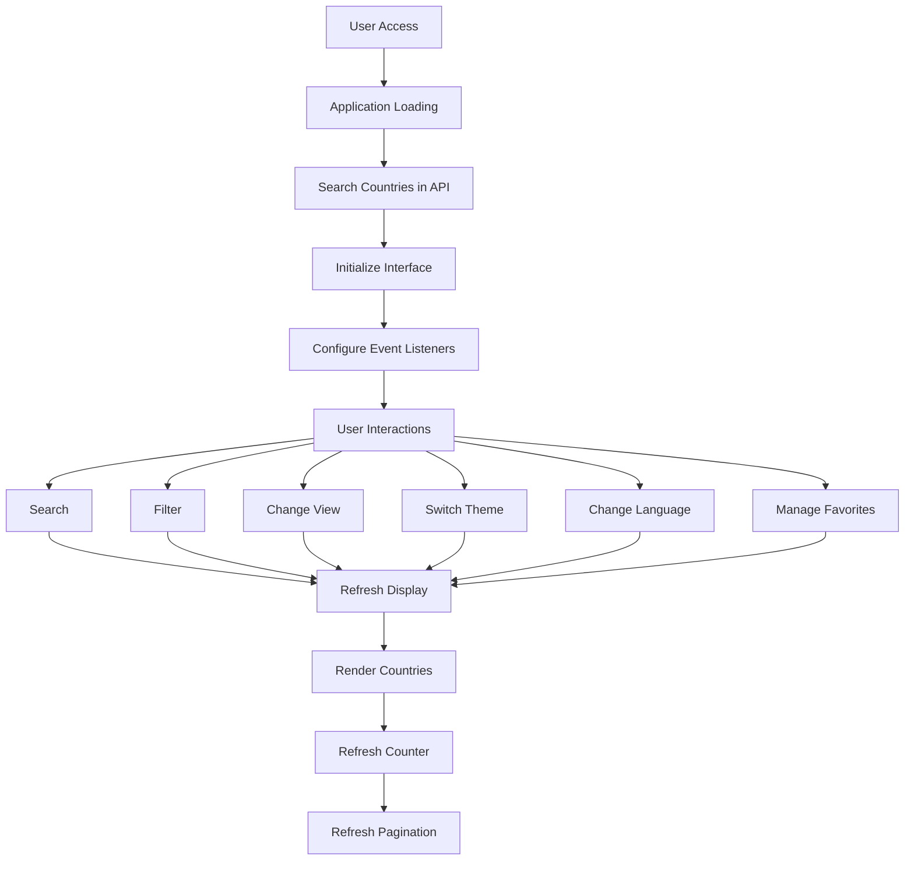

[BR](README-PTBR.md)

# Search Countries 🌍

A modern, elegant and minimalist web application to explore information about countries using the Countries Rest API. This project provides an intuitive interface for users to search, filter and view detailed information about countries around the world.

## 🌟 Features

### Main Features
- 🔍 Real-time country search with debounce
- 🌐 Language support (English and Portuguese)
- 🌓 Light/Dark theme with system preference detection
- 📱 Fully responsive design for all devices
- 💖 Bookmark system with local persistence
- 📊 Dynamic display of country count
- 🔄 Multiple view modes (Grid/List)
- ⚡ Optimized performance with lazy loading

### Search and Filtering
- Instant search with debounce optimization
- Filter by language
- Filter by continent
- Clear filter functionality
- Dynamic display of result count

### Display Options
- Grid view for compact display
- List view for detailed information
- Pagination with dynamic page count
- Responsive layout adapting to screen size

### User Preferences
- Theme preference saved in localStorage
- Language preference persistence
- Favorites list saved locally
- Last used view mode is remembered

## 🛠️ Technical Stack

### Main Technologies
- HTML5
- CSS3 with CSS Variables
- JavaScript (ES6+)

### Libraries and Frameworks
- jQuery 3.6.0
- Bootstrap 5.3.0
- Font Awesome 6.0.0

### APIs
- Rest Countries API v3.1

## 🔧 Project Structure

```
search-countries/
├── index.html # Main HTML Structure
├── assets/
│ ├── css/
│ │ └── style.css # Custom styles and themes
│ └── js/
│ ├── main.js # Main application logic
│ └── translations.js # Internationalization strings
├── README.md # Documentation in English
└── README-PTBR.md # Documentation in Portuguese
```

## 🚀 Getting Started

### Prerequisites
- Modern web browser (Chrome, Firefox, Safari, Edge)
- Internet connection for API access

### Installation

1. Clone the repository:
```bash
git clone https://github.com/yourusername/search-countries.git
```

2. Navigate to the github directory project:
```bash
cd search-countries
```

3. Open index.html in your browser or use a local server:
```bash
python -m http.server 8000
# or
php -S localhost:8000
```

## 📊 Application Flow



## 💾 Local Storage Structure

The application uses localStorage for persistent data:
```javascript
{
"favorites": ["USA", "BRA", "GBR"], // Array of country codes
"theme": "dark" | "light", // Current theme
"language": "en" | "pt-BR" // Current language
}
```

## 🌐 API Integration

### Endpoints Used
- `GET https://restcountries.com/v3.1/all`
- Searches all countries
- Used for initial loading and filtering

### Data Structure
```typescript
interface Country {
name: {
common: string;
official: string;
};
capital: string[];
population: number;
area: number;
languages: Record<string, string>;
flags: {
png: string;
svg: string;
};
continents: string[];
cca3: string; // Country Code
}
```

## 📱 Responsive Breakpoints

- Mobile: < 768px
- Tablet: 768px - 991px
- Laptop: 992px - 1199px
- Desktop: ≥ 1200px

## 🎨 Theme System

### Light Theme Variables
```css
--primary-bg: #ffffff
--secondary-bg: #f8f9fa
--text-color: #212529
--border-color: #dee2e6
```

### Dark Theme Variables
```css
--primary-bg: #1a1a1a
--secondary-bg: #2d2d2d
--text-color: #ffffff
--border-color: #404040
```

## 🤝 How to Contribute

1. Fork the repository
2. Create your feature branch: `git checkout -b feature/AwesomeFeature`
3. Commit your changes: `git commit -m 'Add some AwesomeFeature'`
4. Push to the branch: `git push origin feature/AwesomeFeature`
5. Open a Pull Request

### Commit Guidelines
- Use semantic commit messages
- Keep commits atomic and focused
- Reference issues in commit messages when applicable

## 📈 Future Improvements

- [ ] Add more languages
- [ ] Implement automated testing
- [ ] Add country comparison feature
- [ ] Include statistical charts
- [ ] Add PWA support
- [ ] Implement caching system
- [ ] Add more country details
- [ ] Include interactive maps

## 📄 License

This project is licensed under the MIT License - see the [LICENSE](LICENSE) file for details.

## 👥 Authors

- *Early Work* - [iFallenHunter](https://github.com/iFallenHunter)

## 🙏 Thanks

- [Rest Countries API](https://restcountries.com/) for providing the country data
- [Bootstrap](https://getbootstrap.com/) for the UI framework
- [Font Awesome](https://fontawesome.com/) for the icons
- All the contributors who helped this project grow